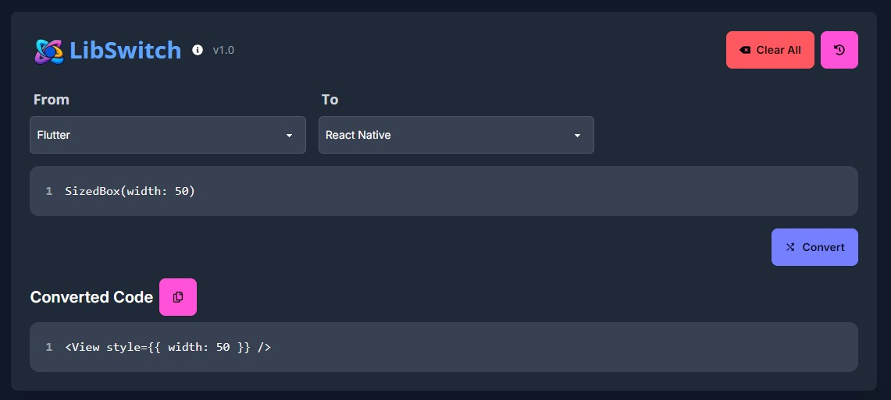

# LibSwitch

LibSwitch is designed to convert code snippets between different libraries. Currently, it supports converting code between Flutter, React Native, React, Vue, Angular, and Svelte. Leveraging OpenAI's ChatGPT, this tool simplifies the process of translating code between these frameworks with ease.
<!-- TODO: update screenshot -->



## Features

- **Code Conversion**: Automatically convert code from one library to another (e.g., from Flutter to React Native).
- **Intuitive UI**: Simple and clean user interface with easy code input and output display.
- **Clipboard Integration**: Easily copy the converted code to your clipboard with a single click.

## Installation

### Prerequisites

- [Node.js](https://nodejs.org/) (v16 or later)
- [npm](https://www.npmjs.com/) (v8 or later)

### Getting Started

1. **Clone the Repository**

   ```bash
   git clone https://github.com/ziadh/LibSwitch.git
   cd LibSwitch
   ```

2. **Install Dependencies**

   ```bash
   npm install
   ```

3. **Set Up Environment Variables**
   Create a .env file in the root directory and add your OpenAI API key:

   ```bash
   NEXT_OPENAI_API_KEY=your_openai_ai_api_key
   ```

4. **Start the Development Server**

   ```bash
   npm start
   ```

The app will be running on http://localhost:3000.

## Usage

1. **Select Libraries**

   - Choose the source library (From) and target library (To) from the dropdown menus.

2. **Enter Code**

   - Input the code snippet you want to convert in the provided textarea.

3. **Convert Code**

   - Click the "Convert" button to initiate the code conversion.

4. **View and Copy Output**

   - The converted code will be displayed in a read-only textarea. Click the copy button to copy the code to your clipboard.


## Contributing

Contributions are welcome! Please open an issue or submit a pull request on GitHub if you have any improvements or bug fixes.

## License

This project is licensed under the MIT License. See the [LICENSE](LICENSE) file for details.

## Contact

For any questions or support, open an issue.

---

Happy coding! 🚀
